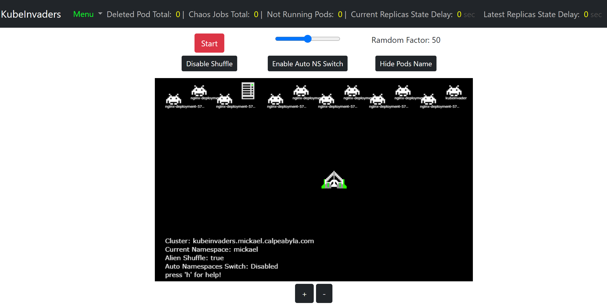

# TP #1

L'objectif de ce TP est de déployer `kube-invaders` et de démontrer qu'il fonctionne correctement: il s'agit d'un outil de 'Chaos Engineering'. C'est-à-dire un outil qui permet de simuler des défaillances au sein d'un cluster Kubernetes ... ce qui nous permet, ensuite, de voir comment les applications déployées se comportent: continuent-elles à fonctionner ou au contrainre deviennent inaccessibles et pendant combien de temps ?

## instructions

Cet outil est composé d'un seul micro-service.
Le travail demandé consiste à déployer `kube-invaders` puis, à déployer une application de test pour valider que `kube-invaders` arrive bien à générer des défaillances sur cette application de test.
Voici le détail des instructions à suivre pour aboutir au résultat demandé:

### mise en oeuvre de `kube-invaders`

- créer un `deployment` avec les caractéristiques suivantes:
  - image à utiliser: `mdimonte/kubeinvaders:v1.9`
  - nombre de réplicas: `1`
  - déclarer le port sur lequel l'application écoute: TCP/8088
  - affecter 5 milicores de CPU en `request` et 20 milicores en `limit`
  - affecter 25 Mi de mémoire en `request` et 75 Mi en `limit`
  - déclarer ces 2 variables:
    1. nom: `ENDPOINT`  
       valeur: exactement la même que celle que vous metter pour votre `ingress`
    2. nom: `NAMESPACE`  
       valeur: le nom de votre namespace (c'est votre prénom)

- créer un `service` permettant de load-balancer le trafique réseau vers l'ensemble des pods qui seront générés grace à votre `deployment` (pour ce deployment il n'y aura qu'un seul pod).  
:fire: vous me prouverez que ce `service` est bien 'associé' au pod du `deployment` kube-invaders

- créer un `ingress` (en utilisant la classe d'ingress `webapprouting.kubernetes.azure.com`) pour exposer cette application à l'extérieur du cluster et ainsi la rendre accessible sur internet.  
Si tout c'est bien passé, normalement en accédant à l'URL renseignée dans votre `ingress` vous devriez obtenir une page similaire à celle-ci:  

### déploiement de l'application de test

- créer un `deployment` avec les caractéristiques suivantes:
  - image à utiliser: `nginx:latest`
  - nombre de réplicas: `10`
  - déclarer le port sur lequel l'application écoute: TCP/80
  - affecter 5 milicores de CPU en `request` et 20 milicores en `limit`
  - affecter 10 Mi de mémoire en `request` et 50 Mi en `limit`

- créer un `service` permettant de load-balancer le trafique réseau vers l'ensemble des pods qui seront générés grace à votre `deployment`.  

- créer un `ingress` (en utilisant la classe d'ingress `webapprouting.kubernetes.azure.com`) pour exposer cette application à l'extérieur du cluster et ainsi la rendre accessible sur internet.

### prouver le bon fonctionnement de `kube-invaders`

En utilisant l'application `kubeinvaders` et l'application `nginx`:  
- démontrer que `kubeinvaders` arrive bien à supprimer des pods de l'application `nginx`
- démontrer que l'application `nginx` continue bien à être disponible malgré la destruction de certains de ces pods.

:bulb: pour faciliter la visée sur les pods depuis `kubeinvaders` vous pouvez cliquer sur le bouton `Disable Shuffle` pour désactiver le déplacement des aliens (qui représentent les pods présents dans votre namespace)

## remise à zéro

:fire: :fire: :fire:  
Avant de passer au TP suivant, penser bien à supprimer tous les objets que vous aurez créés (`deployments`, `services`, `ingresses`) ou qui auraient été créés par les applications (il se peut que des `jobs` aient effectivement été créés), faute de quoi il se peut que vous n'ayez pas suffisamment de ressources (cpu, mémoire, ...) pour les autres TP.
