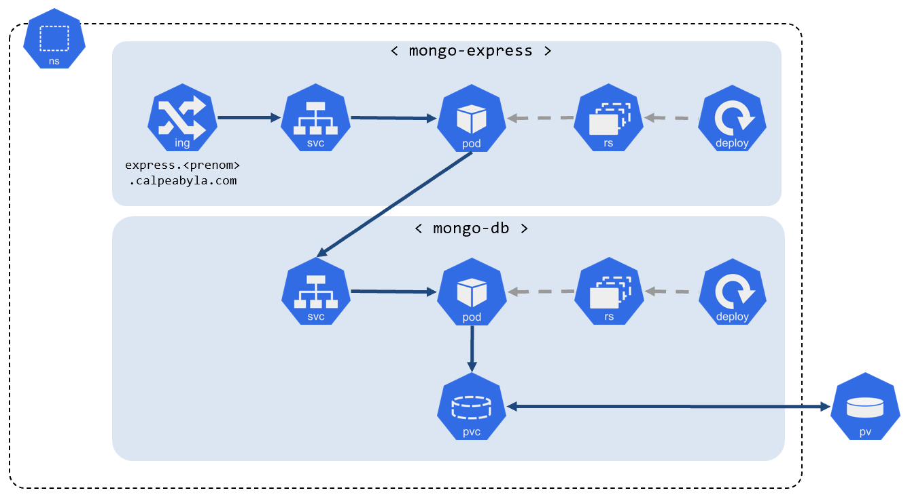

# TP #2

Dans ce TP vous allez déployer un micro-service faisant tourner `mongodb` et un second micro-service basé sur `mongo-express` (qui est une application web permettant d'administrer des bases `mongo`).  

**L'objectif de ce TP est de mettre en oeuvre toutes les bonnes pratiques que nous avons vues ensemble; En particulier celles permettant d'optimiser la disponibilité et la montée en charge des applications déployées sur Kubernetes.**

## architecture

:bulb: ce schéma mentionne uniquement les composants nécessaires au fonctionnement initial de l'application. L'application des bonnes pratiques de mise en oeuvre vous amèneront probablement à créer d'autres objets Kubernetes.

## instructions

### mise en oeuvre de `mongo-db`

- créer un `deployment` avec, **au moins**, les caractéristiques suivantes:
  - image à utiliser: `mongo:7.0.5-jammy`
  - nombre de réplicas: `1`
  - déclarer le port sur lequel l'application écoute: TCP/27017
  - déclarer ces 2 variables:
    1. nom: `MONGO_INITDB_ROOT_USERNAME`  
       Cette variable contiendra le nom de l'utilisateur 'root' que vous voulez que `mongo` crée à son premier lancement
    2. nom: `MONGO_INITDB_ROOT_PASSWORD`  
       Cette variable contiendra le mot de passe de l'utilisteur mentionné juste au dessus
  - utiliser 2 `PVC` de 1Gi chacun à partir de la `storageclass` `managed` et que vous monterez respectivement sous `/data/db` et `/data/configdb` au sein de l'unique conteneur du pod

- créer un `service` de type `ClusterIP` permettant de répartir le trafique réseau vers l'ensemble des pods qui seront générés grace à votre `deployment` (pour ce deployment il n'y aura qu'un seul pod).  
:fire: vous me prouverez que ce `service` est bien 'associé' au pod du `deployment`

### déploiement de l'application `mongo-express`

- créer un `deployment` avec, **au moins**, les caractéristiques suivantes:
  - image à utiliser: `mongo-express:1.0.2-20`
  - nombre de réplicas: `2`
  - déclarer le port sur lequel l'application écoute: TCP/8081
  - déclarer ces 5 variables:
    - nom: `ME_CONFIG_BASICAUTH_USERNAME`  
      Cette variable contiendra le nom d'utilisateur avec lequel vous voulez vous authentifier auprès de l'application web `mongo-express`
    - nom: `ME_CONFIG_BASICAUTH_PASSWORD`  
      Cette variable contiendra le mot de passe de l'utilisteur mentionné juste au dessus
    - nom: `ME_CONFIG_MONGODB_SERVER`  
      Cette variable contiendra le point de contact de la base `mongo-db`
    - nom: `ME_CONFIG_MONGODB_ADMINUSERNAME`  
      Cette variable contiendra le nom de l'utilisateur 'root' que vous aurez décider d'utiliser lors du déploiement du micro-service `mongo-db`
    - nom: `ME_CONFIG_MONGODB_ADMINPASSWORD`  
      Cette variable contiendra le mot de passe du l'utilisateur 'root' de la base `mongo-db`

- créer un `service` de type `ClusterIP` permettant de répartir le trafique réseau vers l'ensemble des pods qui seront générés grace à votre `deployment`.  

- créer un `ingress` (en utilisant la classe d'ingress `webapprouting.kubernetes.azure.com`) pour exposer cette application à l'extérieur du cluster et ainsi la rendre accessible sur internet.

### bonnes pratiques

Après (ou en même temps ;) ) avoir déployé ces 2 micro-services, mettez en oeuvre tous les objets supplémentaires permettant de garantir un fonctionnement optimal de votre application y compris si le nombre d'utilisateurs augmente ou si des défaillances applicatives ou d'infrastructure surviennent.  
Vous justifierez vos choix.

:bomb: **en ce qui concerne le micro-service de base de données (`mongo-db`) il faudra toujours garder un nombre de réplica à `1`.**

### prouver le bon fonctionnement avec `kube-invaders`

Après avoir redéployé l'application `kubeinvaders` utilisez-la pour simuler des défaillances sur les 2 micro-services et confirmer le bon fonctionnement général de l'application.

:bulb: pour faciliter la visée sur les pods depuis `kubeinvaders` vous pouvez cliquer sur le bouton `Disable Shuffle` pour désactiver le déplacement des aliens (qui représentent les pods présents dans votre namespace)
